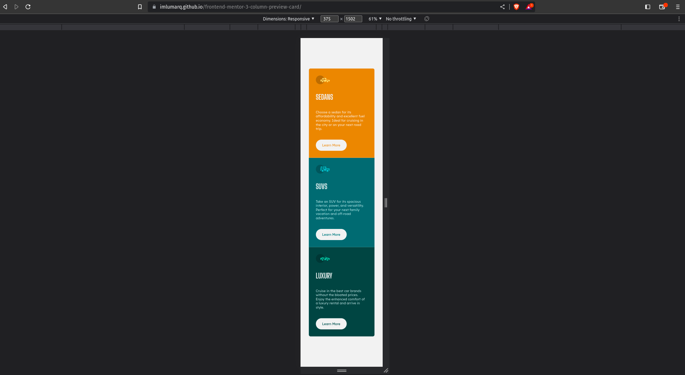

# Frontend Mentor - 3-column preview card component solution

This is a solution to the [3-column preview card component challenge on Frontend Mentor](https://www.frontendmentor.io/challenges/3column-preview-card-component-pH92eAR2-). Frontend Mentor challenges help you improve your coding skills by building realistic projects.

## Table of contents

- [Overview](#overview)
  - [Screenshot](#screenshot)
  - [Links](#links)
- [My process](#my-process)
  - [Built with](#built-with)
- [Author](#author)

## Overview

### The challenge

Users should be able to:

- View the optimal layout depending on their device's screen size
- See hover states for interactive elements

### Screenshot

### Links

- Solution URL: (https://www.frontendmentor.io/solutions/3-column-preview-card-noPYB_HrJ3)
- Live Site URL: (https://imlumarq.github.io/frontend-mentor-3-column-preview-card)
- Github Repository: (https://github.com/imLumarq/frontend-mentor-3-column-preview-card)

## My process

### Built with

- CSS custom properties
- Semantic tags
- Flexbox
- Mobile-first workflow

## Author

- Frontend Mentor - [@imLumarq](https://www.frontendmentor.io/profile/imLumarq)
